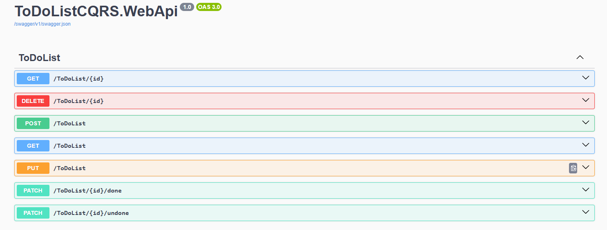

**ToDoListCQRS** — это учебный backend-проект для управления списком задач, построенный с использованием паттерна CQRS, библиотеки MediatR



## реализация паттерна CQRS

Паттерн CQRS разделён на две основные части:

- **Commands:** отвечают за изменение состояния системы (создание, обновление, удаление задач).
- **Queries:** отвечают за получение данных (список задач, детали задачи).
- 
Решение состоит из следующих проектов:

- `Domain` — бизнес-логика и Value Objects, интерфейс репозитория
- `Application` — запросы/команды, их обработчики, DTO, маппинг из доменной сущности в DTO
- `Persistance` —  реализации репозитория,DbContext, работа с EF Core, маппинг из доменной сущности в сущность для EF Core
- `WebAPI` — контроллеры, кастомный обработчик исключений

## Использование MediatR

[MediatR](https://github.com/jbogard/MediatR) — это библиотека для реализации шаблона mediator, которая помогает организовать взаимодействие между компонентами приложения через централизованную точку.

Каждый запрос и команда описаны отдельными классами (например, `CreateToDoCommand`, `GetToDoListQuery`). Команды наследуются от `IRequest<TResponse>`
- Для каждого из них реализован обработчик (`IRequestHandler<TRequest, TResponse>`).
- В контроллерах осуществляется отправка запросов через `IMediator`, например:
  ```csharp
  var result = await _mediator.Send(new GetToDoListQuery());
  ```

## Использование Value Objects
Для повышения надёжности и контроля данных применяются Value Objects — объекты, инкапсулирующие примитивы с дополнительной логикой валидации и правилами.

Пример: TitleValueObject — объект, который гарантирует корректность заголовка задачи (например, минимальная и максимальная длина).

Преимущества:

Централизация логики валидации.

Исключение дублирования проверок по всему приложению.

Повышение читаемости и поддерживаемости.